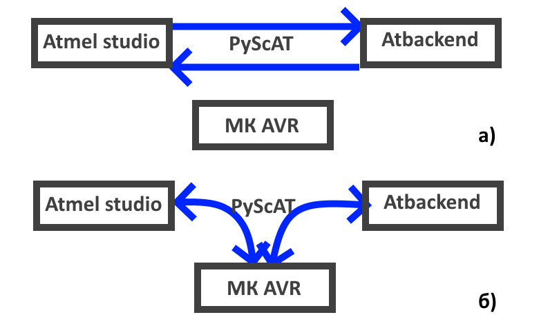
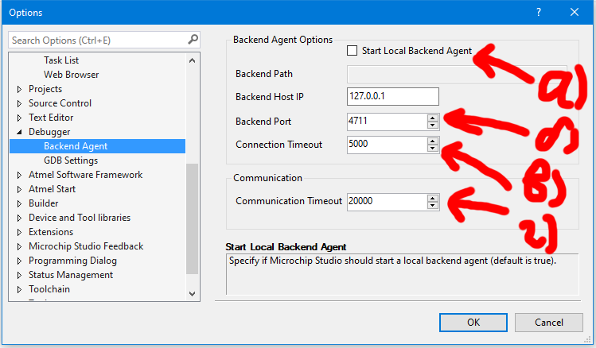

# PyScAT

### PyScAT – отладчик, позволяющий подключить платы с микросхемами AVR к среде Atmel Studio

## Принцип работы
Представляет собой программу-мост между Atmel Studio и ATbackend.  Принцип работы основан на том факте, что Atmel Studio использует сторонний исполняемый файл для проведения отладки программ - ATbackend.exe. При этом Atmel Studio позволяет использовать сторонние отладчики, подключение которых так же происходит через TCP порт. При подключении к Atmel Studio PyScAT запускает экземпляр ATbackend.exe и создаёт 2 потока по 2 разным портам TCP.

- Atmel Studio<->PyScAT
- PyScAT<->ATbackend.exe

А так же производит общение с платой МК AVR по USB

- PyScAT<->МК AVR

Все не управляющие потоки (то есть те, которые не модифицируют содержание регистров/ячеек памяти виртуальной платы МК AVR контекста ATbackend) между Atmel  Studio  и ATbackend происходят в автоматическом режиме. Однако при передаче некоторых запросов, которые касаются контекста МК AVR происходит прерывание потоков автоматической приёмо-передачи, и PyScAT начинает общение с Atmel  Studio  и ATbackend в отдельности, синхронизируя тем самым контексты реальной платы МК AVR  с контекстами виртуальных плат Atmel  Studio  и ATbackend. 

## Запуск PyScAT

### Первоначальная настройка
#### Параметры PyScAT
Предварительно стоит удостовериться, что исполняемый файл PyScAT64.exe или PyScAT32.exe (далее просто PyScAT.exe) расположены в папке вместе с остальными файлами и папками по следующей структуре

*Папка с проектом*
│   PyScAT64.exe
│   PySync_default_settings.ini
│   PySync_settings.ini
│
└───logs

Далее стоит запустить программу PyScAT.exe, выставить соответствующие параметры и сохранить. При этом параметры COM порта **могут меняться** при каждом запуске. Параметры TCP портов могут выставляться любыми, в зависимости от того, какие в данный момент не используются остальными приложениями системы. Порт 4711 используется Atmel Studio по умолчанию.

- Параметры COM порта для связи с платой
-- COM порт
-- Baud rate
- Путь до подключаемых модулей
-- Путь до atbackend
- Свободные TCP порты, которые будут использоваться для общения Atmel Studio<->PyScAT<->ATbackend.exe
-- Порт atmel studio
-- Порт atbackend

#### Параметры Atmel Studio
Перед запуском отладчика требуется провести первоначальную настройку в среде Atmel  Studio.
В меню настроек сверху в приложении нужно зайти в меню настроек отладчика **Tools>Options>Debugger>Backend  Agent**. Далее выставить параметры **а, б, в, г** так как это указано на рисунке ниже

При этом, в случае Atmel Studio 7.0, среда будет **зависать**. Это происходит из-за постоянного поиска отладчика. Дело в том, что сам отладчик PyScAT в это время ещё **не подключён** к Atmel Studio. Его стоит подключать **только** после проведения всех настроек в PyScAT и Atmel Studio.

### **Синхронизация** **PyScAT со стороны МК** **AVR**

Со стороны МК AVR для общения с PyScAT используется блок инструкций на языке AVR ASM, отвечающий на запросы PyScAT. Для синхронизации с PyScAT требуется вызвать блок инструкций USB_debug  с помощью инструкции call.

Пример отлаживаемой программы на языке AVR ASM - **main.asm** - лежит в корне проекта.

### Запуск отладки

Перед отладкой проекта, **необходимо прошить** плату МК AVR скомпилированным **.hex** файлом проекта, используя сторонние методы, например обёртку [AVRDUDESS](https://github.com/ZakKemble/AVRDUDESS) с настройками прошивки для большого количества плат **Arduino**.

Далее в окне PyScAT.exe стоит нажать кнопку **Запустить отладчик** таким образом вначале установиться соединение Atmel Studio<->PyScAT<->ATbackend

Далее необходимо убедиться, что плата МК AVR **подключена к компьютеру** и имеет указанные ранее параметры COM порта

После этого можно **проводить отладку** точно так же, как если бы отладка проводилась на встроенном симуляторе Atmel Studio!

В случае **редактирования** исходных файлов проекта, следует **повторить** все пункты по запуску отладки, начиная с **прошивки** платы МК AVR скомпилированным **.hex** файлом изменённого проекта

